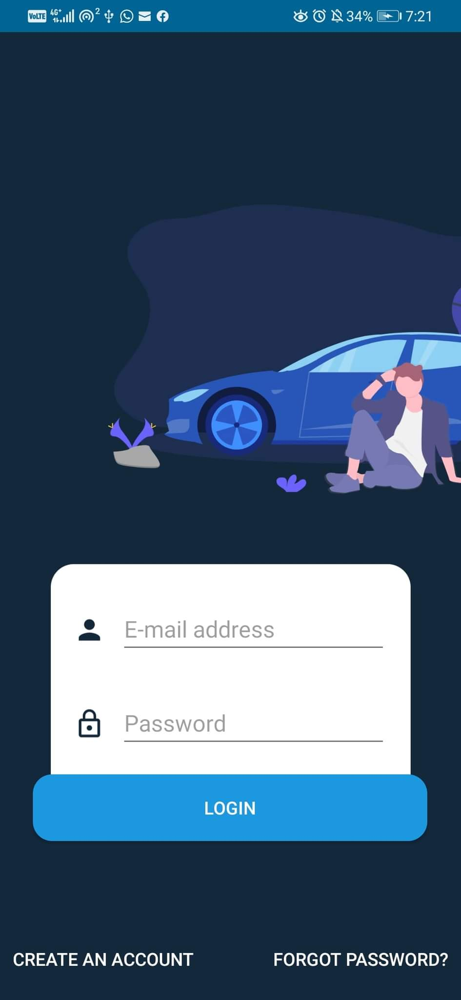
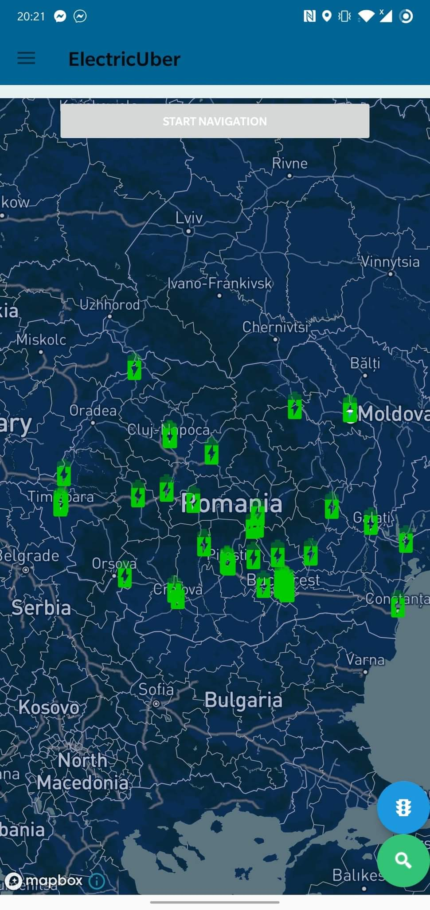
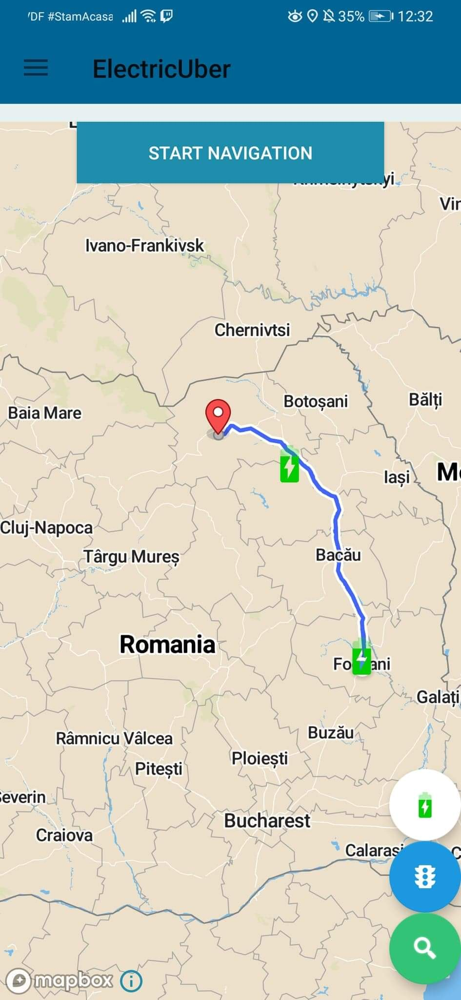
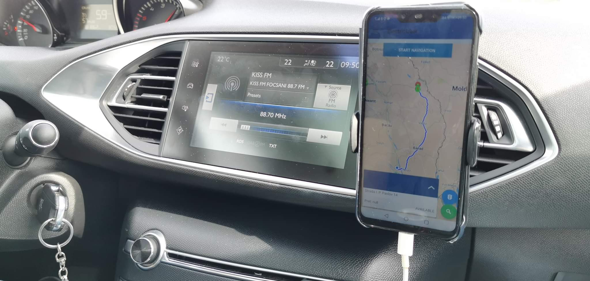

# ElecTrip
Android app designed to provide a multitude of facilities for electric car drivers, including: driving directions, find the nearest charging station, set up travel on the vehicle and charging stations along the way and many others.

The main purpose of the application was to facilitate trips made with an electric car over long distances. 
Finding the charging station along the way could prove to be a challenge, so the app will allow you to find a suitable route in regards with your car and the connectors you have at your disposal.

For the app development we used services provided by www.mapbox.com.

Full promotional video at: https://www.youtube.com/watch?v=MjQ3TVg_3v8    (Credits for editing: Mija Andrei)

API repository: (Credits to Craciun Mihai)
https://github.com/NiceDayZ/UberForElectricCarsAPI?fbclid=IwAR0HSC40qN0W7xNVwoW7zAfgx3FVezkM7G0zOsT0WJVwBIJg4h19nhVmtE4#addConnector

Special thanks to my team:
Popa Stefan-Dorin
Basa Iulian-Danut
Balanica Gabriel
Gheorghe Laura-Bianca
Gina Burlui
Nastasa Petru-Alexandru
